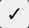

# GCS App


## Description
This mini app demonstrates a proposed foundational infrastructure for a Ground Control Station (GCS) application.

### Key Features:
- WebSocket-based communication
- Bi-directional update events
- Real-time client-side monitoring

## Usage
The app currently supports the creation of a fenced area. This use case illustrates how a client-side action triggers a series of events, with the client subsequently receiving continuous updates from the backend.

To draw a new fenced area (a polygon), click on this button . When finished, click on the 'tick' button () to submit and send the new area to the backend.

Once validated by the backend, new UAV instances are initialized and provide updates each time they change their position, with the updated values displayed in the table.

Drawing a new polygon will terminate previous instances and initialize new ones.

## Installation

### Using Docker
To install and run the app using Docker, follow these steps:

1. Build the Docker image:
   ```sh
   docker-compose build
   docker-compose up
   ```
2. Once the containers are running, you can access the app at http://localhost:3000.
    
### Manual installation

#### Backend
```sh
cd backend
pip install -r requirements.txt
python server.py
```

#### Frontend
```sh
cd frontend
npm install
npm start
```
